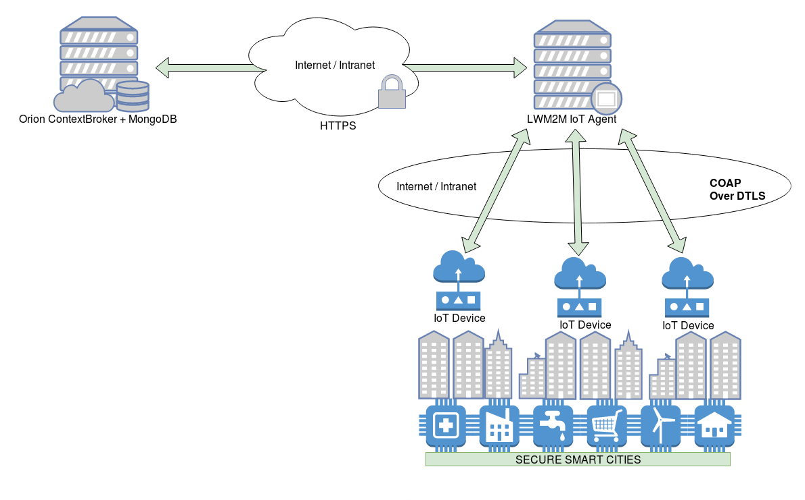
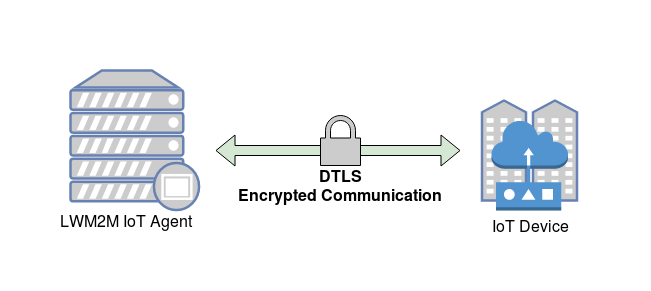
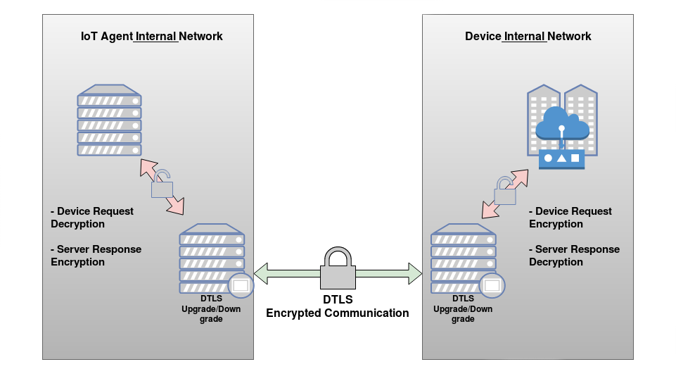
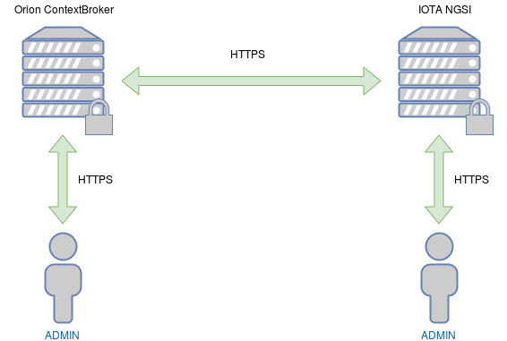

# SecureFiware


### Overview




### End-to-end encryption

#### COAP Device to LWM2M IoT Agent encrypted communication



For the encrypted communication between the device and the IoT agent we've embedded a DTLS server feature in the **lwm2m-node-lib** source code that forwards any request to the plain-text lwm2m udp server via localhost network then forward the response back to the client. We designed this solution to be setup easily in the configuration `.js` file and is totally compatible with the **lightweightm2m-iotagent** as described [here](fiware-improvements/README.md#dtls-configuration) and also demonstrated on the PoC below. Notice that the other lightweightm2m-iotagent features are totally unnafected by this modifications.
The dtls-proxy library was also developed by us and already have more than 300 downloads in the npm (search for **node-dtls-proxy**)



 - Positive points:
   - Enables DTLS communication between UDP servers and UDP clients (of any kind) with minimal or none source code modifications.
   - Really quick to setup.

 - Negative points:
   - A bit slower than a Pure DTLS solution.
   - The client requires dtls support or be able to run a software that implements the dtls proxy downgrade service.

 - Links:
   - [ goldy - IBM Lightweight DTLS proxy ](https://developer.ibm.com/code/open/projects/goldy/)
   - [ node-dtls-proxy ](https://github.com/m4n3dw0lf/node-dtls-proxy)

<br>

#### Orion ContextBroker and LWM2M IoT Agent HTTPS Communication and Support



For the HTTPS support on the Orion ContextBroker we've added a nginx container in the `docker-compose.yml` file that acts like a HTTPS reverse-proxy to the ContextBroker in HTTP context (SSL/TLS Termination), then we've modified the **iotagent-node-lib** used by the **lightweightm2m-iotagent** to support the ContextBroker in HTTPS context, the configuration can be setupt in the `.js` configuration file of the IoTa described [here](fiware-improvements#connect-to-orion-in-https-context), also we modified the IoT Agent with a new feature that starts the NGSI server in HTTPS context too. the configuration can be easily set up in the `.js` configuration file of the IoTA as described [here](fiware-improvements/README.md#iot-agent-https-configuration) just like the https orion configuration.

<br>

### Walkthrough

<details>
<summary>Requirements</summary>
<br>

Clone the repositoy:<br><br>
<code>
git clone https://github.com/m4n3dw0lf/securefiware --recursive
</code>
<br>
<br>
Install <b>Docker</b>: https://docs.docker.com/engine/installation/ and <b>docker-compose</b>: https://docs.docker.com/compose/install/.
<br>
<br>
Since all the Fiware libraries for LWM2M are in NodeJS, install <b>NodeJS</b> and it's package manager <b>NPM</b><br><br>
Run the <b>following command</b>:<br><br>
<code>
sudo apt-get install nodejs nodejs-legacy npm
</code>
<br><br><br>
Also install de node-dtls-proxy library that will be responsible for encrypting the device requests and sending to the LWM2MIoTA in the DTLS context.<br><br>
<code>
sudo npm install -g node-dtls-proxy
</code>
<br>
<br>
</details>
<br>
<details>
<summary>Start the Orion Context Broker and the LWM2M IoT Agent</summary>
<br>
Generate a certificate and key to be used in TLS and DTLS connections of the components
<br>
<br>
<code>
$ openssl req -x509 -nodes -days 365 -newkey rsa:2048 -keyout cert.key -out cert.crt
</code>
<br>
<br>
Run the <b>command below</b> inside this directory to start the orion, mongodb, iota and openssl docker containers
<br>
<br>
<code>
$ sudo docker-compose up
</code>
<br>
<br>
Press CTRL+C to stop the environment
<br>

<h5> Utils:</h5>
<br>
Acessing the MongoDB:
<code>
$ sudo docker exec -it secfiware_mongodb mongo
</code>
<br>
<br>
Acessing the Orion bash:
<code>
$ sudo docker exec -it secfiware_orion bash
</code>
<br>
<br>
Acessing the IoT Agent bash:
<code>
$ sudo docker exec -it secfiware_iota bash
</code>
<br>
<br>
Destroying the environment:
<code>
$ sudo docker-compose down
</code>
<br>
<br>
</details>
<br>
<details>
<summary>Start the IoT Device</summary>
<br>
<h5> Running the LWM2M IoT Device (Client) </h5>
<br>
Enter the <b>fiware-improvements/lwm2m-node-lib</b> directory and install the nodejs requirements:
<br>
<code>
cd fiware-improvements/lwm2m-node-lib/ ; npm install
</code>
<br><br>
Run the LWM2M IoT Device:<br>
<code>
node bin/iotagent-lwm2m-client.js
</code>
<br>
</details>
<br>
<details>
<summary> Secure DTLS and TLS Environment Walkthrough </summary>

- Provisioning a service configuration for devices
```
curl -X POST -k https://localhost:4041/iot/services \
  --header "fiware-service:light_control" \
  --header "fiware-servicepath:/light_control" \
  --header "Content-Type:application/json" -d  '{  
    "services": [
      {
        "resource": "/light_control",
        "apikey": "",
        "type": "Light Control",
        "commands": [],
        "attributes": [
          {
            "name": "On/Off",
            "type": "Boolean"
          }
        ]
      }
    ]
  }'
```

- Provisioning a new device for the service created

```
curl -X POST -k https://localhost:4041/iot/devices \
  --header "fiware-service:light_control" \
  --header "fiware-servicepath:/light_control" \
  --header "Content-Type:application/json" -d '{
    "devices": [
      {
        "device_id": "rasp1",
        "entity_type": "Raspberry",
        "attributes": [
          {
            "name": "On/Off",
            "type": "Boolean"
          }
        ],
        "internal_attributes": {
          "lwm2mResourceMapping": {
            "On/Off" : {
              "objectType": 3311,
              "objectInstance": 0,
              "objectResource": 5850 
            }
          }
        }
      }
    ]
  }'
```


- If you get error on logs about self-signed certificates, you may need to generate a keypair and declare the path on the config-secure.json

- Open another separated terminal and run

```
$ udp2dtls 5687 localhost 5684
```

- Then (on another separated terminal) start an lwm2m-client
```
LWM2M-Client> create /3311/0
LWM2M-Client> connect localhost 5687 rasp1 /raspberry
LWM2M-Client> set /3311/0 5850 On
```

<h5>Query the device in the ContextBroker</h5>

- Run this

```
curl -X POST -k https://localhost:1026/v1/queryContext \
  --header "fiware-service:light_control" \
  --header "fiware-servicepath:/light_control" \
  --header "Content-Type:application/json" \
  --header "Accept:application/json" -d \
  '{"entities": [{"id": "Raspberry:rasp1"}]}'
```

> Notice that you will need to setup a udp2dtls proxy on a different port for each device, unless you already have a client that supports dtls. (The dtls support will be added in the client in future updates)

</details>
<br>
<details>
<summary>Links</summary>
<br>

- [Fiware tour guide application](https://www.fiware.org/devguides/fiware-tour-guide-application-a-tutorial-on-how-to-integrate-the-main-fiware-ges/)

- [IoTa Docs](https://github.com/telefonicaid/lightweightm2m-iotagent/tree/master/docs)

- [lwm2m-node-lib](https://github.com/telefonicaid/lwm2m-node-lib)

- [Devices provisioning](https://github.com/telefonicaid/lightweightm2m-iotagent/blob/master/docs/deviceProvisioning.md)

- [Configuration provisioning (fiware-service)](https://github.com/telefonicaid/lightweightm2m-iotagent/blob/master/docs/configurationProvisioning.md)

- [Installation of client](https://github.com/telefonicaid/lightweightm2m-iotagent/blob/master/docs/configurationProvisioning.md#installation-of-the-client)

- [Using the device](https://github.com/telefonicaid/lightweightm2m-iotagent/blob/master/docs/configurationProvisioning.md#using-the-device)

- [RFC DTLS](https://tools.ietf.org/html/rfc6347)

- [OMA Specification - OMA-LWM2M](http://www.openmobilealliance.org/release/LightweightM2M/V1_0-20170208-A/OMA-TS-LightweightM2M-V1_0-20170208-A.pdf)

- [OMA LWM2M Object and Resource Registry](http://www.openmobilealliance.org/wp/OMNA/LwM2M/LwM2MRegistry.html)

- [Objects and their corresponding Object IDs](https://github.com/IPSO-Alliance/pub/tree/master/reg)

- [IP for Smart Objects - IPSO Objects](https://github.com/IPSO-Alliance/pub/blob/master/README.md)
</details>


### Contributors

|Name|Role|Contact|
|-|-|-|
|Prof. Dr. Sergio Takeo Kofuji| Mentor| kofuji@pad.lsi.usp.br |
|Prof. MSc. Fábio Henrique Cabrini | Mentor | fabio.cabrini@pad.lsi.usp.br |
|Angelo Moura | Developer | m4n3dw0lf@gmail.com |
|Bruno Galvão | Developer | bruno.oliveira109@fatec.sp.gov.br |
|Igor Servulo | Developer | igor.servulo@fatec.sp.gov.br |
|Lucas Pereira| Developer | lucas.pereira49@fatec.sp.gov.br |
|Anderson A. Alves da Silva | Collaborator | anderson.silva@pad.lsi.usp.br |
|Noris Junior | Collaborator | norisjunior@gmail.com |
|Albérico de Castro | Collaborator | alberico.castro@pad.lsi.usp.br |
|Filippo Valiante Filho | Collaborator | filippo.valiante@pad.lsi.usp.br |
